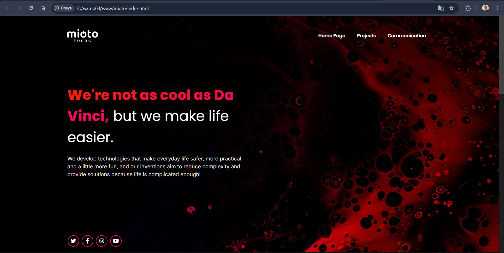

# Frontend-Only Website

This repository contains the source code for a **static promotional website** developed using HTML, CSS, and JavaScript. The project is fully **frontend-based**, meaning there is no backend or database integration.

## About the Project

This website serves as a **presentation and informational platform**, showcasing content through a well-designed and responsive layout. The project is suitable for:
- Business or personal portfolios
- Product or service promotions
- Landing pages

## Project Images


### Features
- **Fully responsive design** for mobile, tablet, and desktop views
- **Modern UI/UX design** with smooth animations and effects
- **Optimized performance** with lightweight code
- **Pure frontend technologies** (HTML, CSS, JavaScript)

## Technologies Used
- **HTML** for structuring the content
- **CSS** (including Flexbox and Grid) for styling and layout
- **JavaScript** for interactive elements and animations

## Installation & Usage
1. Clone the repository:
   ```sh
   https://github.com/HuseyinSelen/HTML-Website.git
   ```
2. Set up a local server (e.g., XAMPP, LAMP, or MAMP).
3. Open the `index.html` file in your browser.
4. Customize the HTML and CSS as needed.

## Contribution
This project is open for improvements. Feel free to fork, modify, and submit pull requests!

## Contact
For any inquiries or collaboration opportunities, reach out:
- **Email:** selen.huseyin8@gmail.com

If you find this project useful, don't forget to star the repository ⭐

